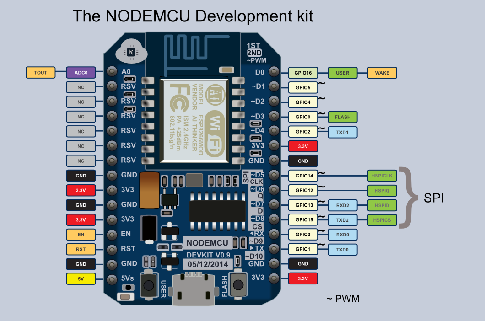

# Products used in this lesson
* NodeMCU ESP8266 <https://www.amazon.com/HiLetgo-Version-NodeMCU-Internet-Development/dp/B010O1G1ES>
* Micro USB cable <https://www.amazon.com/AmazonBasics-USB-Male-Micro-Cable/dp/B01EK87T9M>
* LED <https://www.amazon.com/Assorted-Clear-Emitting-Diodes-Colors/dp/B00UWBJM0Q>
* Breadboard <https://www.amazon.com/Aketek-Solderless-BreadBoard-tie-points-power/dp/B01258UZMC>
* 22 Ohm resistor <https://www.amazon.com/gp/product/B00E9YQQSS>
* Jumper Wire Kit <https://www.amazon.com/gp/product/B014JOV4TI>

# Wiring 
1. Insert a LED into the breadboard with the negative side (short side) to the right of the positive side (long side)
In the above example the negative lead of the LED is plugged into 23b and the positive lead is plugged into 22b
2. Setup the breadboard with a jumper pin connecting GND on the ESP8266 to the ground rail on the breadboard
3. Connect a jumper pin from the ground rail to the LED
4. Connect a resistor from pin D2 on the ESP8266 to the positive lead of the LED. It does not matter which way you plug in the resistor.
5. The finished design should look like the following:


# Flashing an LED
1. Get to the python REPL ```
screen /dev/tty.SLAB_USBtoUART 115200
```
2. Type the following code ```
import machine
led = machine.Pin(4, machine.Pin.OUT)
led.high()
led.low()
led.high()
```
3. The LED should turn on

### Let's walk through what is going on in step 2.
`import machine` provides access to GPIO, the real time clock, Timer classes and a few other things <http://docs.micropython.org/en/latest/esp8266/library/machine.html>

`led = machine.Pin(4, machine.Pin.OUT)` will setup an output pin on GPIO4 which happens to map to D2 on the NodeMCU v2. ESP8266 pin labels do not map exactly to their GPIO counterparts so keep the following chart handy


`led.high()` sets the pins value to high

`led.low()` sets the pins value to low

`led.high()` sets the pins value to high
